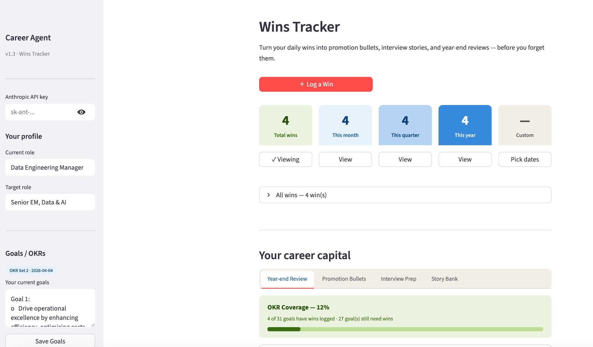
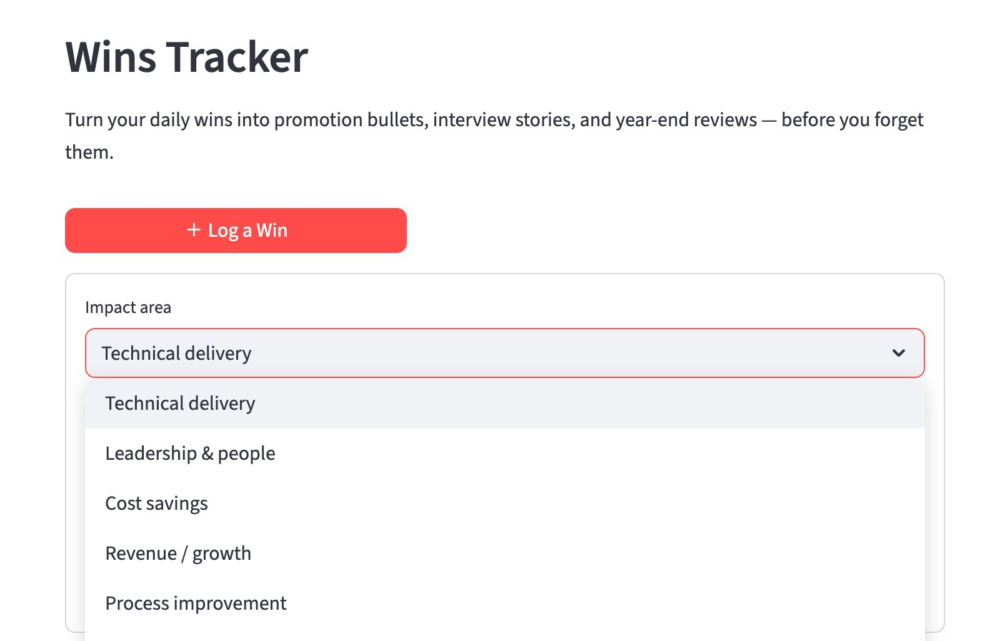
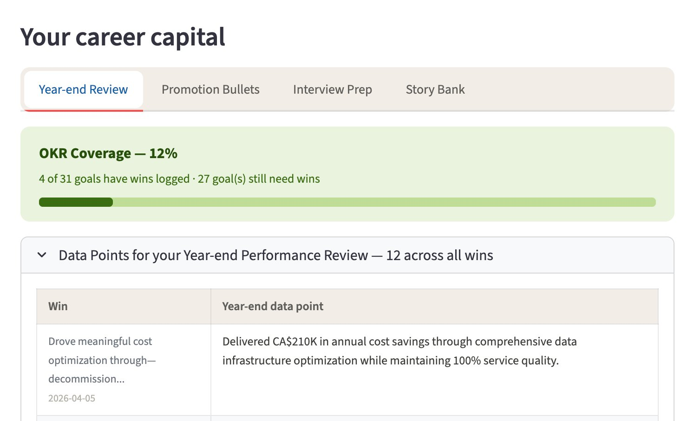
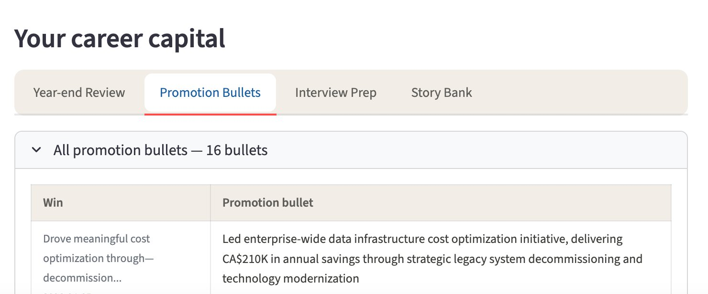
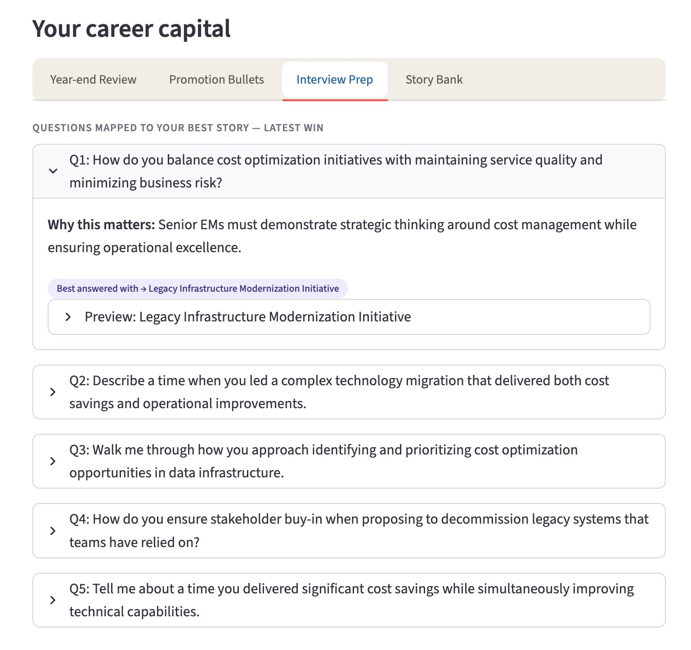
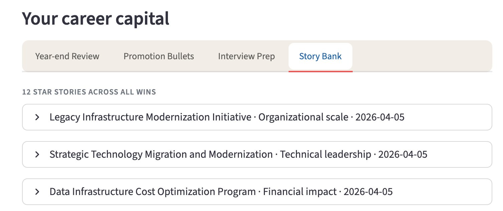

# Career Catalyst Agent — Career Capital Agent

## Why this exists

Most professionals undersell themselves at review time — not because they didn't deliver, but because they forgot what they did.

You work hard all year. You solve problems, lead initiatives, mentor people, ship projects. But when performance review season arrives, you're staring at a blank page trying to remember what you actually accomplished six months ago.

This app solves that. Log your accomplishments as they happen — a project delivered, a problem solved, a team helped, a process improved. Get interview stories, promotion bullets, and year-end review material instantly — powered by Claude.

**No more scrambling at review season. No more underselling yourself in interviews.**

---

## What it does

Log a win → Generate career capital → Use it everywhere.

A **win** is any accomplishment, no matter how small — something you delivered, improved, led, or solved. Each one you log instantly generates four kinds of career-ready output:

| Output | What it is |
|---|---|
| STAR Stories | Situation-Task-Action-Result narratives from different angles — ready for interviews |
| Promotion Bullets | Impact-first sentences ready to paste into a promo packet or LinkedIn |
| Interview Questions | Technical and behavioural questions mapped to your best story for each question |
| Year-end Data Points | Crisp, metric-led sentences for year-end reviews and performance conversations |

All outputs are contextualised to your current role and target role.

---

## Screenshots

### Dashboard — your career capital at a glance


### Log a Win — describe your accomplishment


### Year-end Review — OKR coverage and data points


### Promotion Bullets — all bullets from all wins


### Interview Prep — questions mapped to your best story


### Story Bank — your full STAR story library


---

## Features

### 🏆 Wins Dashboard
- Log accomplishments with an impact area tag — Technical delivery, Leadership & people, Cost savings, Data & AI, and more
- Filter by period: All time, This month, This quarter, This year, or a custom date range
- Metric cards show win counts at a glance
- Edit or delete any logged accomplishment
- All wins stored locally in `wins.json` — persistent across sessions

### 🤖 Career Capital Generation
- Powered by Claude — generates structured, senior-level output from a single sentence input
- Every output is contextualised to your current role and target role
- Verify your metrics before using — Claude uses only what you provide

### 📊 Year-end Review Tab
- OKR Coverage tracker — visual progress bar showing how many goals have wins logged
- Generates a full year-end review mapped to your OKRs/Goals
- Grouped by theme if no OKRs are set
- Download as `.txt`

### 🚀 Promotion Bullets Tab
- All promotion bullets from all wins in one scannable table
- Download all bullets as `.txt`

### 🎯 Interview Prep Tab
- Technical and behavioural interview questions generated from your latest win
- Each question shows why it matters and which STAR story best answers it
- Inline story preview — rehearse without leaving the tab

### 📖 Story Bank Tab
- All STAR stories from all wins in one library
- Labelled by story title, angle, and date
- Download any individual story as `.txt`

### ⚙️ Sidebar
- Anthropic API key input — session only, never stored to disk
- Current role and target role fields — saved to `wins.json`
- Goals / OKRs text area — save and version your goal sets with timestamps

---

## Setup

### Prerequisites

**Python 3.9 or higher**

Check if you have it:
```bash
python3 --version
```

If not installed or below 3.9, download from [python.org/downloads](https://python.org/downloads) and run the installer.

**Anthropic API key**

The career capital generation features require an Anthropic API key. Here's how to get one:

1. Go to [console.anthropic.com](https://console.anthropic.com) and create a free account
2. Click **API Keys** in the left sidebar
3. Click **Create Key** — give it a name like `career-catalyst`
4. Copy the key — it starts with `sk-ant-`
5. Go to **Billing** and load a minimum of $5 credit — at typical daily usage this lasts several months

### Install and run

```bash
git clone https://github.com/VaniBirlangi/career-catalyst-agent.git
cd career-catalyst-agent
pip install streamlit anthropic certifi
streamlit run app.py
```

Then open `http://localhost:8501` in your browser.

### First-time configuration
1. Enter your Anthropic API key in the sidebar
2. Set your **Current role** and **Target role**
3. Optionally paste your OKRs / Goals and click **Save Goals**
4. Click **＋ Log a Win** and describe an accomplishment
5. Click **Generate career capital** — outputs appear instantly across all tabs

---

## Data & privacy

All data is stored locally in `wins.json` in the project root. Nothing is sent anywhere except to the Anthropic API for generation — win text and role context only. Your API key is entered per session and never written to disk.

---

## Tech stack

| Layer | Technology |
|---|---|
| UI framework | Streamlit |
| AI model | Claude Sonnet (`claude-sonnet-4-20250514`) |
| API client | `anthropic` Python SDK |
| Storage | Local JSON (`wins.json`) |
| SSL | `certifi` |

---

## Project structure

```
career-catalyst-agent/
├── app.py              # Main application — all logic and UI
├── screenshots/        # README screenshots
├── wins.json           # Auto-created on first win logged (excluded from Git)
└── README.md
```

### wins.json structure

```json
{
  "profile": { "current_role": "...", "target_role": "..." },
  "okr_sets": [ { "id": "...", "label": "...", "date": "...", "okrs": "..." } ],
  "wins": [ { "id": "...", "date": "...", "win": "...", "impact": "...", "okr_set_id": "...", "output": {} } ]
}
```

---

## Roadmap

This is Module 1 of 4 planned modules:

| Module | Status |
|---|---|
| Module 1 — Career Capital Agent | ✅ Live |
| Module 2 — Job Discovery | 🔜 Coming soon |
| Module 3 — Skill Gap Insights | 🔜 Coming soon |
| Module 4 — Career Roadmap | 🔜 Coming soon |

---

## Built by

Built to solve a real problem — professionals who deliver great work but struggle to articulate it when it matters most. This app is part of a broader mission to leverage AI for meaningful career and life outcomes.

Part of the [DataMuscle YouTube channel](https://youtube.com/@datamuscle?si=F89amklP4w7d18mk) — a community helping data professionals and aspirants grow through practical AI and data skills.

---

## License

MIT — use it, fork it, build on it.
